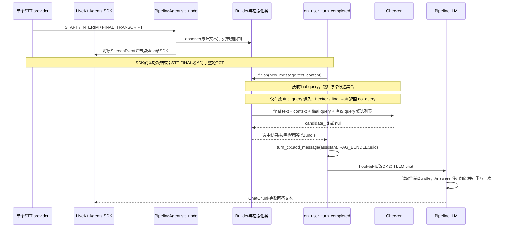

# LiveKit 接口、STT 分批与三类问题设计

2026-09-10 更新。当前接口与已实现调度说明；历史 checkpoint `a2e8947`/`34e09db` 保留原范围。time/text/hybrid 已实施，Builder 默认 v1、v2/v3 可选。用户要求优先减少 false positive；Krites 只列入阅读，排除当前 PoC。运行与证据入口见 [README](README.md) 和 [文档导航](DOCUMENTATION.md)。

## 1. 已实现的接口和时间顺序

依据本机 livekit-agents1.8.0 与 `rag_poc/livekit_adapter.py`、`pipeline.py`、`endpoints.py`。这些函数属于Python Agents运行时；不是往LiveKit房间DataChannel发送知识，也不是注入音频模型。

逐步接口：

| 步骤 | 精确接口 | 数据与效果 |
|---|---|---|
| 接收转写 | `Agent.stt_node(audio, model_settings)` 包装 `Agent.default.stt_node` | 不开启第二STT；原SpeechEvent继续yield给SDK |
| 开始本轮 | `Pipeline.start_turn(confirmed)` | 深拷贝已确认历史，分配turn，重置本轮候选 |
| 中间文本 | `Pipeline.observe(text)` | 异步启动Builder；不把partial写入正式对话历史 |
| EOT入口 | `Agent.on_user_turn_completed(turn_ctx, new_message)` | `new_message.text_content`作为最终文本权威来源 |
| 检索决策 | `await Pipeline.finish(final_text)` | final query→Checker→有界等待选中检索或按需查询 |
| 当前注入 | `turn_ctx.add_message(role='assistant', content='RAG_BUNDLE:'+uuid)` | 仅注入当前bundle指针，真实知识不在此字符串里 |
| 取知识并生成 | `PipelineLLM.chat` → `PipelineStream._run` → `Pipeline.answer` → `Answerer.respond` | 从本轮内存bundle取rows，经JSON payload发送DeepSeek；最多一次重写检索 |
| 回传SDK | `llm.ChatChunk(delta=llm.ChoiceDelta(role='assistant', content=answer))` | 当前一次性发完整文本，无TTS，也未测TTFT |

**不要把当前代码误写成“把知识直接注入通用LiveKit LLM prompt”。** 当前是自定义LLM provider解释内部标记。换成普通DeepSeek/OpenAI插件后，它不会理解RAG_BUNDLE，必须改为在hook中放入实际格式化证据，或者由新的LLM节点/工具从明确的应用状态取证据；旧指针不能直接复用。

本机SDK `voice/agent_activity.py` 在调用hook前创建chat context副本；hook更改只用于当前生成，不默认持久化到Agent.chat_ctx。SDK随后加入最终用户消息。当前实现不调用update_chat_ctx来持久保存知识，避免旧证据变成后续问题的默认事实。生产confirmed history必须从已提交会话事件更新；当前回放器在收到assistant完成事件后手动维护它。

## 2. 哪些东西变化时最需要保证

1. **最终文本与上下文归属**：Bundle必须属于当前turn和当时的confirmed context；后到的旧任务不能注入、覆写、或回答新轮次。生产barge-in/恢复讲话需要provider事件/turn修订契约；当前只验证顺序轮次。
2. **FINAL_TRANSCRIPT不是EOT**：某些STT发的是段落确认，用户仍在讲话。不能一律禁用所有FINAL段；也不能把INTERIM累计结果反复append。必须按真实provider明确“替换当前段”与“追加已确认段”的语义。
3. **无效候选不进入答案证据**：Checker只负责query适用性；候选取消/出错/跨轮必须拒绝。Answerer继续负责知识充分性，不得作为放宽Checker的理由。
4. **候选集合冻结**：在Checker输入构造时固定候选ID、query、任务所属轮次；允许任务完成状态随后变化，但不能把新query悄悄塞到同一个已检查ID。完成后再次确认owner/phase。
5. **任务共享与deadline**：相同Query共享的检索不能因取消另一个candidate被误杀。Builder、Checker、DB等待、Answer都有有限预算；候选不可用应走常规路径，禁止等所有投机任务。取消本地await不证明远端API停止计费。
6. **注入时机与原生preemptive兼容**：当前关闭原生preemptive。SDK检查最终transcript、chat_ctx、tools、tool_choice是否与预生成一致；变化会使预生成失效。当前bundle只在hook后就绪，单纯开启开关既可能让自定义LLM提前找不到bundle，也会因随机新标记改变chat_ctx导致失效。迁移需单独provider状态契约与取消测试。
7. **可观测与比较公平性**：保留turn/candidate/span、等待与计算耗时、取消原因、是否在EOT前已有证据。三个Checker独立；模型/序列化/阈值变化不可无标记混入原基准。

源代码仅用于验证接口，不建议应用调用SDK私有方法。官方入口：[Nodes](https://docs.livekit.io/agents/logic/nodes/)、[RAG](https://docs.livekit.io/agents/logic/external-data/)、[Preemptive](https://docs.livekit.io/agents/multimodality/audio/)。

## 3. 当前 STT 快照与 Checker 批次

START_OF_SPEECH 开始本轮。INTERIM 替换当前 interim；FINAL_TRANSCRIPT 追加确认段并清空 interim。两者都生成累计文本 observe，不把 partial 写入正式历史。provider 重发 FINAL 段尚无通用去重保证。

STT 快照进入 Builder，不是每 150 ms 发送 Checker。final query 就绪后，Checker 查看一次冻结的有效候选集合；输入是 final text、confirmed context、final Query、候选 id/query/completed，不包含知识行。partial wait 不建检索、不进入集合；final wait 提前返回 no_query，完全跳过 Checker。无候选时 LLM/semantic 不进行模型调用。

exact 比较完整 Query；semantic 只 embed 解析后的 Query；LLM 使用上述全部参数。相同 Query 可在当前有效候选范围共享 task，这不是跨轮缓存或通用语义去重。三个新策略的在途共享/淘汰与 wait 分支已有 [边界回归](test_candidate_boundaries.py)。Answerer 对 no_query 仍可重写，不能把 wait 当成整轮无风险证明。

## 4. 已实现的分批策略与尚未实现的契约

用户已确认时间累计、文本变化累计、混合三组对照。实现于pipeline.py；CLI默认`time`，Python Pipeline构造器仍默认`legacy`以保持既有离线调用兼容。比较时必须记录trigger_config，旧触发策略可用 `--trigger-policy legacy` 对照；完整 checkpoint 应检出对应提交并按原证据配置复现。

- `--trigger-policy time|text|hybrid|legacy`：新三组统一使用一个partial Builder在途与一个最新pending快照。新观察覆盖pending，而非排队所有版本。
- `--trigger-ms 150`：time首个pending开始计时，后续从上次实际提交计时。hybrid使用同样时间上限；不是输入每更新一次就重置的debounce。
- `--change-units 3`：从上次实际提交文本到最新文本的插入、删除、替换总变化量，每段编辑取max(old_units,new_units)。英文按词与标点、汉字按字分单元；此分词不是语言学等价词数。相同长度改口也计数。只用于触发，不是semantic similarity。
- hybrid在变化量达到阈值或时间到达时提交；没有新内容不重复调用。
- `--max-builder-calls 6`仅限定每轮partial实际请求次数；final Builder仍可单独调用。有效候选保留最近2个，wait计入请求预算但不占有效候选。覆盖候选时不误杀仍被其他有效候选共享的检索。
- `--builder-handoff-ms 50`：EOT丢弃未发pending，只等待完全相同文本的在途Builder最多此预算；已完成retrieve可接管，wait不能证明最终无query。超时先标记superseded并取消，再走final Builder；忽略取消的远端/本地调用仍可能继续，但不得发布知识。
- 相同文本的比较仍是空白归一化后的严格匹配，标点变化可能走fallback，不声称语义等价接管。
- STT FINAL段仍是合法输入，因为不一定代表EOT。新调度不保证所有final附近投机都消失：text/hybrid可能在EOT尚未被SDK确认前触发；后续按接管规则处理。不能借未来已知的EOT回溯宣称该调用不该启动。

默认参数是可复现实验起点，不是推荐最优阈值。这组调度实现未改 Checker；后续 Builder v2 是独立可选实验。Krites/vCache 不进入 PoC。

### legacy 的历史兼容行为

legacy 仍保留：空白归一化后的文本去重；不足 min_interval 的新快照直接丢弃，不补发；每轮最多 2 个 candidate，wait/失败也占名额；partial 串行，final Builder 不受该 semaphore 限制。final 可给所有 pending Builder 一个 grace 窗口。它不是 CLI 当前默认策略。CLI 默认 speculate=False；只有显式启用后才发生提前调度。

### 生产迁移仍缺什么

Candidate.revision 与当前 turn 的快照修订计数已经存在。完整 TranscriptSnapshot/provider segment ID/context_revision 契约尚未落地；不能将本地 revision 计数称作真实 STT 修订协议。真实 provider 的多段 FINAL 重发、barge-in、恢复讲话和重叠轮次仍需单独验证。短输入、丢弃 pending、有界同输入接管、旧任务晚返回已有控制测试；不代表上述生产能力已完成。

## 5. 长问题、短问题、follow-up分别解释

这不是三个天然互斥类别：follow-up也可能长。实验采用“长度/剩余窗口”与“上下文依赖”两个维度，报表单列以下三种常见场景。运行时先不用另一个LLM强制分类，也不靠英文词数规则硬套中文。

| 场景 | 主要机会 | Builder处理 | Checker和回退 | 应测失败 |
|---|---|---|---|---|
| 长的独立问题 | 关键实体/条件早出现后还有输入窗口 | 合并累计快照，允许关键更新形成新候选，避免只保留最早2批 | final检查完整条件；晚出现限制/否定使旧候选失效 | 关键条件放末尾、改口、跨段FINAL、连续partial |
| 短的独立问题 | 说话内窗口可能小；STT final到EOT的间隙可能仍有价值 | 候选尚未产生就常规final；相同输入避免两条Builder重复竞争 | 无候选跳过模型Checker；原生preemptive必须单独改造provider/hook | “怎么退款”末词才决定意图、没有partial、终点突发两事件 |
| 上下文追问 | 上轮实体已确定，“库存呢/多久/为什么”即可补充意图 | 输入已确认上下文+当前片段，解析成自包含Query；不共享未提交assistant草稿 | 当前query仍需和候选适用性匹配；换实体/指代歧义直接回退或澄清 | “另一个呢”、Chai→Chang、否定、旧历史污染、数字省略 |

当前SQL查询返回整行，所以“Chai价格→库存”可能共用Query；这不等于真实文档库也能共用证据。若真实检索按字段/文档区分，Query必须显式包含requested attributes，不能用当前省略字段的schema代表生产任务。

每组同时报告FP/全部决策、FP/负例、FP/接受复用、FN/正例、正确复用覆盖率、Builder/Checker调用数、EOT前可用证据比例、final到完整文本耗时。不能只用总accuracy掩盖错误复用。

## 6. 阅读清单与PoC边界

- **Krites — Asynchronous Verified Semantic Caching for Tiered LLM Architectures**，https://arxiv.org/abs/2602.13165 。状态：待读、仅参考，明确不进入当前PoC。研究重点是后台验证后将静态答案晋升到动态缓存，为未来请求服务；依赖重复流量、答案可复用性与verifier质量。论文§3.2/§5用oracle做评估，不能证明真实judge稳定性。用户本次明确排除。
- **vCache — Verified Semantic Prompt Caching**，https://arxiv.org/html/2502.03771v3 。状态：概念澄清，尚未实现。不是grid search工具：按缓存条目保存相似度/正确性观测，拟合sigmoid关系和置信范围，结合错误预算决定explore（新调用拿标签）还是exploit（复用）。论文Algorithm1/§4；保证依赖i.i.d与sigmoid假设（§6）。当前阈值扫描只是离线参数对照，不能称作vCache。用于response-cache的正确性信号如何改成query适用性仍是未解决迁移问题。

下一步：第 4 节调度已实现；优先核验 Builder 的约束表达及 no_query 后 Answerer 的改写。见最新 [挑战评测](evidence/builder-challenge-20260910/README.md)。默认参数与 prompt 暂不修改。

## 7. Builder 约束保真实验

可选 v3 在 v2 后增加通用规则：不能静默删除用户条件，schema 无法表达则 wait；普通有界查询仍允许 retrieve。不改变数据类型、Checker 或 Answerer。[同批36条对照](evidence/builder-fidelity-20260910/README.md)仍发现两条新负例漏条件，其中一条从 v2 的解析器拒绝变成 v3 的合法错误 Query。故本规则是实验 prompt，不是确定性保证。默认 v1 保留；final wait 后 Answerer 重写的既有风险仍存在。
