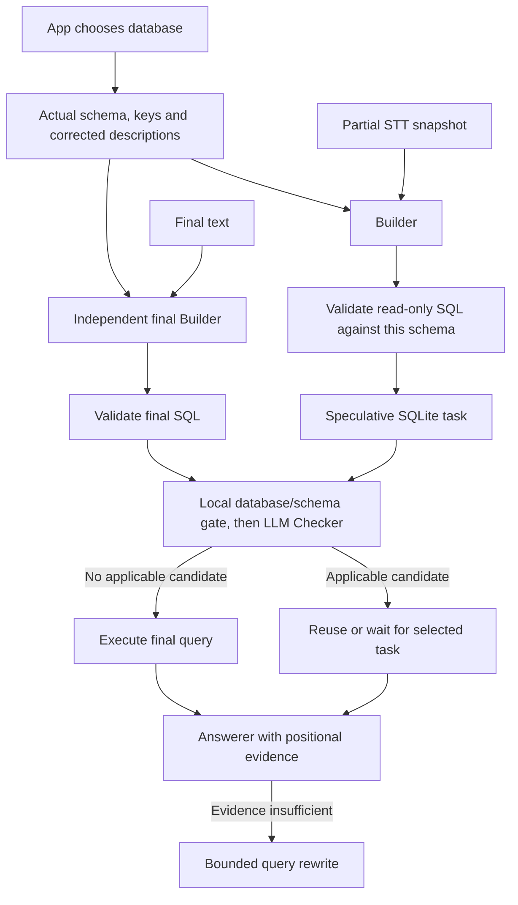

# v6: schema-bound multi-table SQL

v6 extends the experiment from v5's fixed Northwind table to the eight real BIRD databases in [complex-data](../complex-data/README.md). The selected data has 54 tables across eight separate databases, 413 columns and 346 corrected questions. Short requests can require several joins: `superhero:792`, “What is Abomination's superpower?”, traverses three tables.

This release replaces the query contract, schema input and SQLite execution adapter. It reuses the unchanged **v5 SQLPipeline and v4 ordered-turn scheduler/timing**. v4 and v5 remain separate checkpoints. This is a local SQLite implementation; it has not been connected to company Vertex, Cloud SQL, real STT or a heavy RAG service. No audio caching or QA cache population is included.

## Implemented flow



The schema passed to Builder includes table DDL, columns/types/keys, declared foreign keys and corrected descriptions. It does not load whole tables into the prompt or infer missing relationships. This gives Builder much more context than the old product-specific prompt; its size and endpoint cost need measurement on the actual deployment.

The application's selected database binds every validated query to `(sql, db_id, schema_id)`. The model emits only `{"action":"retrieve","query":{"sql":"..."}}` or `{"action":"wait","query":null}`. Model output cannot select a database. Query equality therefore includes the scope used by shared speculative tasks. The fingerprint covers schema and descriptions; it does **not** represent data freshness, tenant permissions or authorization.

SQLite compiles the original SQL under a read-only table/function authorizer to resolve columns, aliases, CTEs and nested queries. SQLGlot checks statement shape and size; it does not rewrite the SQL. Database execution rechecks query scope and schema version. The supported public workload includes JOINs, aliases, CTEs, nested SELECTs, DISTINCT, aggregates, CASE, arithmetic, casts, dates and windows.

There is no implicit `LIMIT 20`. Row/time/byte limits stop a result explicitly instead of changing the request. Output rows are `{"columns":["id","id"],"values":[1,2]}`, preserving duplicate JOIN column names and column positions. Cancellation interrupts the SQLite worker and waits for cleanup. Unknown columns, writes, multiple statements, SQL parameters, other databases, virtual tables and unsupported functions fail validation. SQLite's double-quoted-string fallback is disabled so a misspelled quoted column cannot silently become a constant.

Checker still judges applicability of a candidate against the final request, and Answerer judges evidence sufficiency. SQL permission or a successful query does not establish either. The final Builder remains a paid step in the existing policy; adding multi-table support does not itself eliminate that latency.

## Run locally

Use **Python 3.12+** with SQLite support for `Connection.setconfig` and `SQLITE_DBCONFIG_DQS_DML`; initialization fails explicitly if strict quoted-identifier handling is unavailable. This run uses Python 3.12.14 / SQLite 3.53.1. Python's SQLite build is separate from pip dependencies.

From `v6/`:

```sh
python3 -m venv .venv
source .venv/bin/activate
python -m pip install -r requirements.txt
python -m pytest -q
python -m multitable_poc.run check-data --out evidence/adapter-new-run
```

Download the public data first using the instructions in `../complex-data/README.md` if `.data/` is absent after clone. The check command creates a new output directory and refuses to overwrite an existing run. It uses no model endpoint or API key. Runtime logs show each case's validation, execution, comparison and elapsed time; `summary.json` and `cases.json` retain versions and hashes.

For an explicitly configured OpenAI-compatible endpoint, copy `.env.example` to `.env`, set the endpoint/model/key, then start with a controlled baseline:

```sh
python -m multitable_poc.run evaluate \
  --case-ids superhero:792 student_club:1389 \
  --arms final-only --max-calls 2 \
  --out evidence/online-baseline-smoke
```

These two cases are an endpoint smoke test, not a persuasive accuracy benchmark. Omitting `--case-ids` and `--limit` selects all 346 cases; set the call budget to cover the intended run. The call cap includes failed/cancelled requests and reserves calls before concurrent HTTP awaits. An insufficient remaining budget leaves `status.json` incomplete and the CLI exits nonzero. Results are persisted as cases finish.

The default output budgets are Builder 2048 tokens, Checker 512 and Answerer 1024; the Builder budget is configurable through `RAG_BUILDER_OUTPUT_TOKENS`. Length-stopped responses are rejected even if they happen to contain parseable JSON. The transport does not silently select a model or retry requests. It records usage and durations, not authorization headers or keys. Native Vertex clients can implement the `call(role, instruction, payload)` interface instead; authentication and provider-specific options still require company-side integration.

## Comparing final-only and speculative paths

BIRD has no speech timeline. A speculative run requires an explicit `--schedules` JSON file keyed by `db_id:question_id`:

```json
{
  "superhero:792": {
    "source_label": "manually scripted example; not measured speech",
    "final_at_ms": 700,
    "snapshots": [
      {"at_ms": 0, "text": "What is Abomination's"},
      {"at_ms": 300, "text": "What is Abomination's superpower?"}
    ]
  }
}
```

Use `--arms final-only speculative --schedules path.json`. The sample times above illustrate the file format only; they were not measured or used to claim an improvement. Snapshots are cumulative transcript revisions, not per-word deltas. Their timestamps must be nonnegative, ordered and no later than final text. The trigger remains configurable: `--trigger-policy time|text|hybrid`, `--min-interval-ms 150`, `--change-threshold 3`, `--max-partials 2`. The 150 ms value remains an experiment setting, not a confirmed company recommendation.

Each arm uses the same database, final question and evidence policy. Arm order rotates by case. `--evidence-policy none` is the default. `provided` includes BIRD's question-specific hints **only at the final Builder**, never in partial Builder requests; those hints can disclose information from later words. Neither `SQL` nor `original_SQL` is passed to any model. Gold is executed through a separate connection after online timings/costs have been captured.

Default measurement stops at database evidence readiness after final text. `--answer` adds the answer/rewrite path and separately records answer completion. Neither measure is time to first answer token or first audio. Per-step logs retain Builder, validation, HTTP, Checker, retrieval, answer and cleanup durations. The summary pairs only runs whose nonempty results match the reference; it also shows all outcomes so correctness failures remain visible.

Initial retrieval evidence is frozen before Answerer runs. An answer-time rewrite can improve `answer_evidence_comparison`, but cannot retroactively improve initial retrieval quality, erase a bad reuse, or qualify its earlier latency for the successful-retrieval comparison. Answer text correctness is not scored by SQL result agreement.

Answerer receives up to 100 evidence rows with explicit total/shown counts and a `truncated` flag. This presentation limit never changes SQL execution or evaluator results. It must not claim an exhaustive answer from truncated evidence.

## Verification and remaining limits

See [RESULTS.md](RESULTS.md) for actual commands, counts, failures found and final evidence. Unit fixtures and scripted endpoints test behavior; they are not substitutes for the public dataset or measurements of Builder accuracy.

The evaluator compares values by column position, retaining duplicate rows. Without top-level ORDER BY it compares multisets; with ORDER BY it compares sequences. Aliases may differ. Two empty results are reported separately because this row protocol lacks empty-result column metadata. Float comparison is exact; tied ordering, clock-dependent SQL and one finite data snapshot limit interpretation. None of this proves logical SQL equivalence.

Complex schema correctness is now testable, but no measured Vertex model quality, cache precision, cache-hit latency, speculative speedup or LiveKit audio latency is claimed for v6. The prepared 200 cache candidates and 146 unlabeled questions remain a separate data allocation. One- or two-word real followups require contextual data beyond BIRD's single-turn questions.

## Company integration contract

| Surface | Interface / responsibility | Preserve when replacing SQLite or HTTP |
|---|---|---|
| Schema routing | `SQLiteCatalog(path, db_id, description_dir=...)`; actual schema payload | App owns DB/tenant routing; model cannot choose it. Refresh catalog on schema change. |
| Query validation | `catalog.validate(sql) -> Query(sql, db_id, schema_id)` | Dialect-specific name/scope/function validation; preserve all request conditions, limits and output shape. |
| Execution | `await catalog.search(query)`; `await catalog.close()` | Effective read-only privileges, bounded results/time, real cancellation, no partial result labeled complete. |
| Builder transport | `await endpoint.call(role, instruction, payload)`; `.metrics` list; `await .close()` | Correct JSON contract, complete-response checks, explicit model/token/call budgets, no secrets in logs. |
| LiveKit adapter | Existing `start_turn(context)`, `observe(cumulative_text)`, `finish(final_text)`, `answer(bundle)` | Finalization/turn ownership; freeze obsolete Builder work; only wait for selected retrieval; avoid shared mutable scope. |
| Cache / reuse | Query identity includes database/schema | Add authorized tenant/data freshness where relevant; matching schema is not an authorization decision. |
| Evaluation | Separate reference execution after online measurement | Gold and full-question hints must not leak into prefix generation; errors/truncation are not successful answers. |

For Cloud SQL/PostgreSQL, implement a PostgreSQL catalog with actual schema and effective read-role/function restrictions, plus its own compile/cancel tests. SQLite's authorizer is not portable permission enforcement, and successful SQLite gold execution does not prove dialect parity. The model transport is independently replaceable by the company's Vertex client. Keep the existing LiveKit adapter ownership contract; the new library should not introduce a second STT or block STT event callbacks.

[Design, delivery and learning handoff](vibe-discipline/index.md). This implementation is an AI demonstration. A code walkthrough and learner-owned checks remain separate from test success.
